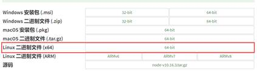

# 基于 node 的 puppeteer 环境搭建

>author: jwensh  
date: 2022.11.05

[TOC]


## 安装node（二进制文件安装， 哪种方式都可以，最后安装完了配置环境变量）

* 进入官网下载最新的node版本（<https://nodejs.org/zh-cn/download/），好像没法使用wget>下载，所以可以下载到本机在上传到服务器的自定义目录下

    

* 服务上解压后，node直接可用，配置环境变量即可：

    ```shell
    export NODE_HOME=/data/tools/node-dev/node-v10.16.3-linux-x64
    export PATH=$NODE_HOME/bin:$PATH
    ```

* 环境环境变量配置完后，source生效，即可使用node、npm命令；

* 因为内容依赖的问题，可安装 cnpm 来避免墙的影响，全局安装，使用淘宝的仓库： `npm install -g cnpm --registry=https://registry.npm.taobao.org`

## 安装puppeteer（两个方案，都可使用)

* 使用cnpm直接安装puppeteer安装：`cnpm install puppeteer` （不会报错且能直接下载chromium）

* 使用npm安装puppeteer安装：`npm install puppeteer` （可能会下载chromium报错，可以使用 `export PUPPETEER_SKIP_CHROMIUM_DOWNLOAD=0`，来跳过chromium下载，然后单独下载linux版本的chromium来使用）；

  * 如果只用B方案安装puppeteer，去<https://commondatastorage.googleapis.com/chromium-browser-snapshots/index.html?prefix=Linux_x64/，下载最新的chromium>；

  * 下载chromium到服务器，也是直接解压使用，截图脚本中指定即可

    ```shell
    executablePath: '/data/tools/puppeteer-dev/chrome/chrome-linux/chrome'
    ```

## 安装中文字体库（解决截图乱码问题： 本步骤可以放到第四步后面，如果截图没有乱码，可放弃步骤操作）

* 因系统原因Ubuntu和Centos基础不一样,安装的字体不一样，所以针对centos的话，直接下载字体安装即可（类似window的字体）；

* 前往字体库下载字体，最好选宋体（宋体 <http://www.font5.com.cn/font_download.php?id=150&part=1237886897>），其他字体可能可会出现乱码情况；

* Centos安装字体的教程（<https://fbd.intelleeegooo.cc/install-chinese-font-on-centos/>），按照教程处理即可；

## 编写截图脚本测试

* 安装完成后会在当前目录下生成一个node_modules目录，在同级目录下新加 `test.js`，内容如下：

    ```js
    const puppeteer = require('puppeteer');

    (async () => {
        const browser = await puppeteer.launch({headless: true,args: ['--no-sandbox']});
        const page = await browser.newPage();
        await page.goto('https://baike.sogou.com');
        await page.screenshot({path: 'example-1.png'});
        
        await browser.close();
    })();
    ```

* 提示：非桌面版一定要加上图中标红的内容，headless默认是true可以不加，args必须要加，不然会报错；

* 还有一个可能会报错，在launch时报错缺少so依赖，如果缺少的是libXss.so，使用命令解决依赖：`yum install libXScrnSaver-1.2.2-6.1.el7.x86_64`

* 如果其他依赖报错，看具体错误具体分析，我主要是遇到libXss.so；

## 非安装建立新项目

* 安装完puppeteer后，当前目录就是一个新项目，如果还想新建一个项目，就跳出本目录

* 在新目录下执行命令即可： `cnpm install puppeteer –save-dev`

* 涉及相关命令、语法参考node
