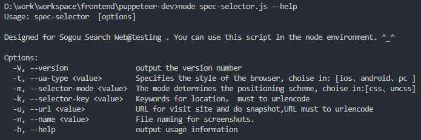
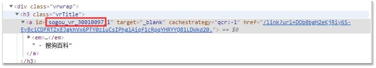
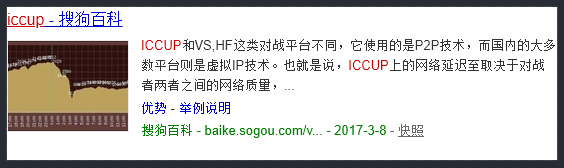

# node.js下使用 puppeteer 构建截图方案

[如果使用 python：传送门 python pyppeteer](https://miyakogi.github.io/pyppeteer/ )

## 脚本实现



* Css selecto的调用方式

    ```shell
    node spec-selector.js -t ios  -m css -k div%5bid*%3d%22sogou_vr_70019705%22%5d -u http%3a%2f%2f10.144.13.224%2fweb%2fsearchList.jsp%3fkeyword%3d%25E6%25B8%25B8%25E8%25AE%25B0%26pid%3d -n jayzhen
    ```

    ```shell
    node spec-selector.js –t android –m css –k div%5bid*%3d%22sogou_vr_30010097%22%5d -u https%3a%2f%2fwap.sogou.com%2fweb%2fsearchList.jsp%3fs_from%3dpcsearch%26keyword%3diccup -n jwensh
    ```

* PC 卡片的调用方式：

    ```shell
    node spec-selector.js -t pc -m uncss -k sogou_vr_30010097  -u https%3a%2f%2fwww.sogou.com%2fweb%3fquery%3diccup -n jwensh
    ```

> 参数说明（主用5个参数）：  
-t：指的是浏览器访问的方式ios、android、pc（小写，不用引号包裹）；  
-m：指定-k内容的定位方式是css selector还是非css selector；  
-k：元素定位的值（数据库读取出来的状态下，再一次url_encode,避免特殊字符导致命令行解析出错）；  
-u：访问的url（数据库读取出来的状态下，再一次url_encode,避免特殊字符导致命令行解析出错）；  
-n：截图后的文件命名（只用写名字即可，后缀无需添加，也可指定路径，如： ../path/jwensh, jwensh是截图的文件名）  

命令参数设置了强相关检验，如果没有都传就不执行截图操作；

> 注意：

1. -m 参数与-k的对应，按照约定 -m 为uncss的时候，-k是pc的vrid，截图规则是找到该元素的爷爷层级元素，进行截图,这里querySelector只取用第一个元素；





2. -m css的时候需要时一个完整的css selector的内容，如：div[id*="sogou_vr_30010097"]

3. 关于脚本执行结果标记：
    * 0 正常
    * 1 页面打不开，超时等
    * 2 我的python部分执行异常 比如puppeteer崩了
    * 3 js执行整体出错，或者是命令行参数异常
    * 4 页面无法正常解析，或者截图失败等

## USE Node.js in Routine Testing

### Instatll Node.js and npm in window or linux

* 可以参考 [linux安装pupputeer示例](./puppeteer-dev/readme-install.md)

> 注意：

* 安装要区别全局和非全局之分
* 要了解安装 [--save和--save-dev的区别](https://segmentfault.com/q/1010000005163089)
* 要了解如何卸载多余的插件
* 如何使用[package.josn](https://docs.npmjs.com/files/package.json)文件组织项目内容

### How to Learn Node.js

* [Node.js v10.16.3 Documentation](https://nodejs.org/dist/latest-v10.x/docs/api/) (查询基础api使用方式)

* [MDN web doc](https://developer.mozilla.org/en-US/docs/Web/JavaScript) (最新的js使用方案)

* [ECMAScript 6 入门](http://es6.ruanyifeng.com/#docs/module) (知道怎么写)

* [npm 插件查找](https://www.npmjs.com/browse/depended) (需要什么去找)

### 使用node来完成日常的测试需要

* 使用[cypress](https://docs.cypress.io/zh-cn/api/api/table-of-contents.html)来完成UI自动化测试
* 使用[puppeteer](https://zhaoqize.github.io/puppeteer-api-zh_CN/)来完成UI检测和截图
* 使用[postman](https://learning.getpostman.com/docs/postman/scripts/test_scripts/)来完成接口测试的断言
